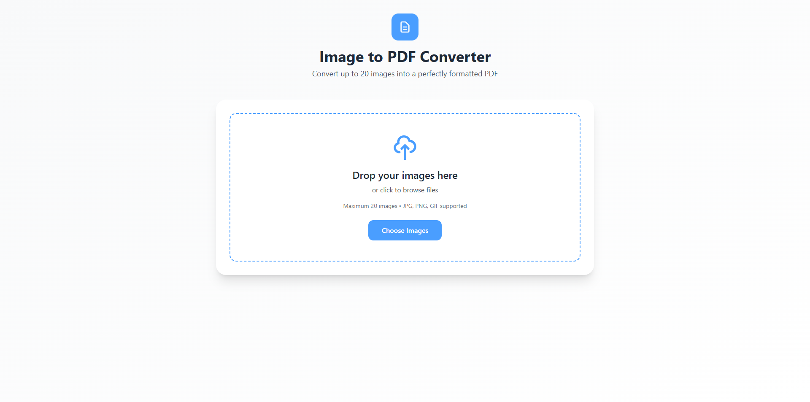

# Image to PDF Converter

A web application that converts multiple images into a single PDF file.

## Features

- **Multi-Image Upload**: Support for up to 20 images per conversion
- **Drag & Drop Interface**: Intuitive file upload with visual feedback
- **Image Reordering**: Drag and drop thumbnails to reorder images before conversion
- **Perfect Aspect Ratios**: Maintains original image proportions in PDF
- **Centered Layout**: Images are automatically centered on each PDF page with proper margins
- **Format Support**: Accepts JPG, PNG, and GIF image formats
- **Responsive Design**: Works on desktop, tablet, and mobile devices
- **Modern UI**: Clean, professional interface with blue and white color scheme

## How to Use

1. **Upload Images**: 
   - Drag and drop images onto the upload area, or
   - Click "Choose Images" to browse and select files
   - Maximum 20 images supported

2. **Reorder Images** (Optional):
   - Drag image thumbnails to reorder them
   - The PDF will be generated in the order shown

3. **Generate PDF**:
   - Click "Generate PDF" button
   - Wait for processing to complete
   - PDF will automatically download with timestamp
## Dependencies

- [Tailwind CSS](https://tailwindcss.com/) - Utility-first CSS framework (CDN)
- [jsPDF](https://github.com/parallax/jsPDF) - PDF generation library (CDN)

## Credits

- **Developer**: Hashier Holmes 💙
- **Powered by**: jsPDF
